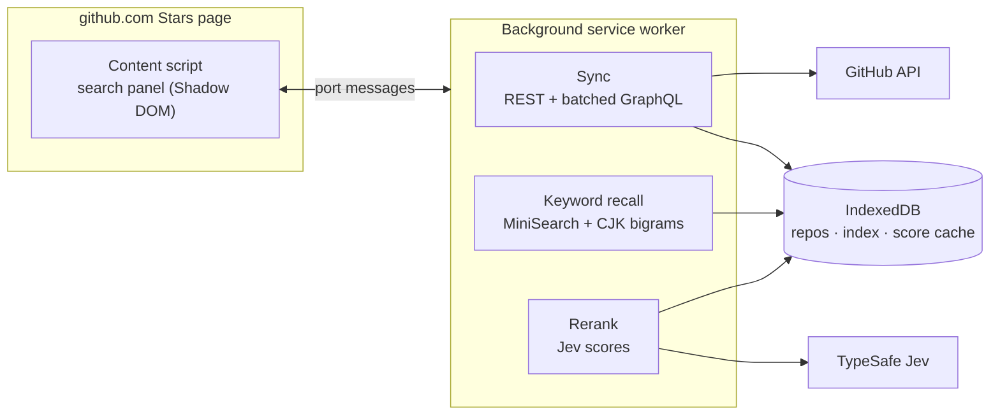

<div align="center">


<a href="#-usage">
  
</a>

<p>
  <a href="https://github.com/DracoYan-111/GStars/actions/workflows/ci.yml"></a>
  
  <a href="LICENSE"></a>
  <a href="https://github.com/DracoYan-111/GStars/stargazers"></a>
</p>

<p>
  
  
  
</p>

<p>
  
  
  
  
  
</p>

**English** · [简体中文](README.zh-CN.md)

<sub>🔍 Find that repo you starred three years ago — just describe it.</sub>

</div>

---

## ✨ What is GStars?

GStars adds a search box to the top of any GitHub user's **Stars** page. Describe what you are looking for — in English, Chinese, or a mix, such as `claude code skills to save tokens` — and it finds the matching repositories among everything that user has starred.

<table>
  <tr>
    <td width="50%" valign="top">
      <h3>🧠 Natural-language search</h3>
      Keyword recall runs locally first, then results are re-ranked by relevance with TypeSafe's <a href="https://docs.typesafe.ai">Jev</a> decision model.
    </td>
    <td width="50%" valign="top">
      <h3>👤 Works on anyone</h3>
      Open <code>github.com/{user}?tab=stars</code> or <code>github.com/stars/{user}</code> and start searching.
    </td>
  </tr>
  <tr>
    <td valign="top">
      <h3>🏠 Local first</h3>
      Stars, READMEs and the search index live in your browser's IndexedDB. There is no backend server.
    </td>
    <td valign="top">
      <h3>⚡ Fast sync</h3>
      READMEs are fetched through batched GraphQL queries: about <b>1,500 stars in ~35 seconds</b>, then a quiet incremental check every 5 minutes.
    </td>
  </tr>
  <tr>
    <td valign="top">
      <h3>🀄 Chinese-aware</h3>
      A CJK bigram tokenizer makes Chinese and mixed-language queries match as well as English ones.
    </td>
    <td valign="top">
      <h3>🚫 No generative AI</h3>
      GStars does not translate, summarize or generate text. Jev is only used to score relevance.
    </td>
  </tr>
</table>

## 📦 Install

| Browser | Status |
| --- | --- |
|  | Coming soon to the Chrome Web Store |
|  | Coming soon to Edge Add-ons |
|  | Coming soon to Firefox Add-ons |
| 🛠️ From source | Build it (see [Development](#-development)), then load `.output/chrome-mv3` in `chrome://extensions` with Developer mode on |

## 🔑 Setup

GStars needs two keys, entered on its options page. They are stored **only in your browser**.

| Key | Where to get it | Notes |
| --- | --- | --- |
| 🐙 GitHub token | [github.com/settings/personal-access-tokens](https://github.com/settings/personal-access-tokens) | No scopes needed. It only raises the API rate limit. |
| 🤖 Jev key | [console.typesafe.ai/keys](https://console.typesafe.ai/keys) | Used for relevance scoring. Billed by TypeSafe per request. |

> [!TIP]
> Click **Test connection** on the options page to check both keys before your first search.

## 🚀 Usage

1. **Pick a user.** Click the toolbar icon, enter a GitHub username and confirm. GStars starts syncing and opens that user's Stars page. You can also open any Stars page directly.
2. **Watch it sync.** Progress is drawn around the search box, with a `fetched/total` counter on its corner. Search unlocks when sync finishes.
3. **Ask.** Type a query and press <kbd>Enter</kbd>. Keyword matches appear instantly, then get replaced by the relevance-ranked list. The best match gets a wiggling 👍.
4. **Navigate.** <kbd>↑</kbd> / <kbd>↓</kbd> to select, <kbd>Enter</kbd> to open. Out of ideas? The 🔀 button writes an example query from that user's own topics.

The options page also lets you switch the UI language (English / 简体中文), the minimum relevance score, and concurrency limits.

## ⚙️ How it works



<details>
<summary><b>Details</b></summary>

- All network requests are made by the background worker. The content script never calls an external API.
- If the user has at most `FULL_SCAN_LIMIT` (default 1,500) repos, every repo is scored; otherwise only the top 200 keyword matches are.
- Scores are cached per query, README version and question version, so repeating a query costs nothing.
- Numeric signals (stars, dates) are handled in code and are never sent to Jev.
- Sync is resumable: the MV3 service worker can be stopped at any time and picks up where it left off.

</details>

## 🔒 Privacy

GStars has **no server** and **collects no analytics**. Your query and the public metadata of candidate repos are sent to TypeSafe for scoring. See [PRIVACY.md](PRIVACY.md) for the full details.

## 🧑‍💻 Development

Requires Node.js 20+ and pnpm.

```bash
pnpm install
pnpm dev              # Chrome, with hot reload
pnpm dev:firefox
pnpm test             # unit tests (Vitest)
pnpm compile          # type check
pnpm build            # → .output/chrome-mv3
pnpm build:firefox    # → .output/firefox-mv2
pnpm zip && pnpm zip:firefox   # store packages
```

<details>
<summary><b>📁 Project structure</b></summary>

```text
entrypoints/
  background.ts        network requests, sync and search orchestration
  stars.content.ts     injects the panel into Stars pages (Turbo-aware)
  popup/  options/     toolbar popup and options page
lib/
  core/                pure functions (no browser APIs): tokenizer, README cleaner,
                       ranking, Jev question template, settings validation, …
  ui/                  panel (Shadow DOM), sync indicator, animations, styles
  github.ts jev.ts     API clients
  sync.ts search.ts    resumable sync; recall → score → rank
  db.ts index.ts       Dexie schema; MiniSearch index persistence
assets/                source images (icon, SVG icons inlined at build time)
public/                files copied as-is: toolbar icons, _locales
tests/                 Vitest unit tests for lib/core
evals/                 offline relevance evaluation (recall@10, MRR)
```

</details>

<details>
<summary><b>📊 Relevance evaluation</b></summary>

`evals/queries.yaml` holds hand-labelled queries in Chinese, English and a mix of both. The evaluation runs in Node and reuses `lib/core`:

```bash
GITHUB_TOKEN=... JEV_API_KEY=... pnpm eval
```

Re-run it whenever you change the Jev question wording (and bump `QUESTION_VERSION`), `MIN_SCORE`, or the README budget.

</details>

## 🤝 Contributing

Issues and pull requests are welcome! Please run `pnpm compile && pnpm test` before opening a PR — CI runs the same checks plus both browser builds.

## ⭐ Star History

<a href="https://star-history.com/#DracoYan-111/GStars&Date">
  
</a>

## 📄 License

[MIT](LICENSE) © DracoYan-111

<div align="center">

<sub>If GStars helped you find something, a ⭐ helps others find GStars.</sub>


<p align="right"><a href="#top">⬆ Back to top</a></p>

</div>
