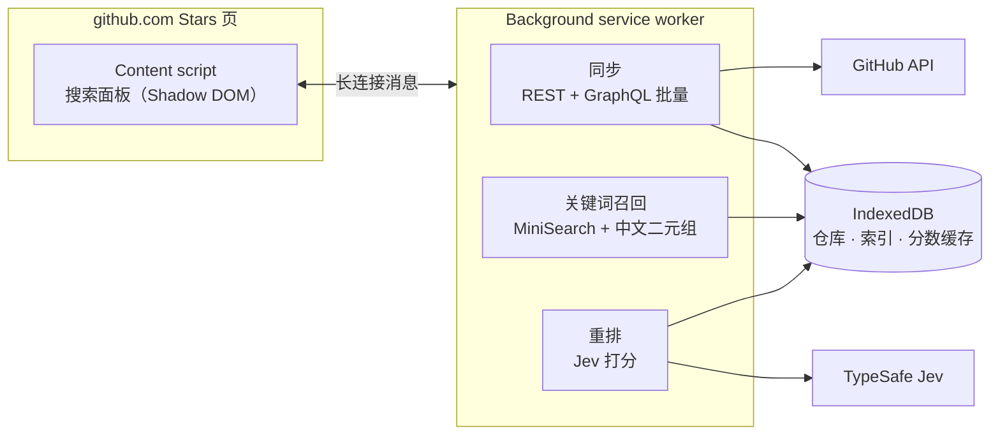

<div align="center">


<a href="#-使用">
  
</a>

<p>
  <a href="https://github.com/DracoYan-111/GStars/actions/workflows/ci.yml"></a>
  
  <a href="LICENSE"></a>
  <a href="https://github.com/DracoYan-111/GStars/stargazers"></a>
</p>

<p>
  
  
  
</p>

<p>
  
  
  
  
  
</p>

[English](README.md) · **简体中文**

<sub>🔍 三年前 star 过的那个仓库，描述一下就能找回来。</sub>

</div>

---

## ✨ GStars 是什么？

GStars 在任意 GitHub 用户的 **Stars** 页面顶部加一个搜索框。用一句话描述你想找的东西，中文、英文或混着写都行，比如 `claude code 节约token skills`，它会从这个用户 star 过的全部仓库里找出相关的。

<table>
  <tr>
    <td width="50%" valign="top">
      <h3>🧠 自然语言检索</h3>
      先在本地做关键词召回，再用 TypeSafe 的 <a href="https://docs.typesafe.ai">Jev</a> 决策模型按相关度重排。
    </td>
    <td width="50%" valign="top">
      <h3>👤 适用于任何用户</h3>
      打开 <code>github.com/{user}?tab=stars</code> 或 <code>github.com/stars/{user}</code> 就能搜。
    </td>
  </tr>
  <tr>
    <td valign="top">
      <h3>🏠 数据在本地</h3>
      star 列表、README 和搜索索引都存在浏览器的 IndexedDB 里，没有后端服务。
    </td>
    <td valign="top">
      <h3>⚡ 同步快</h3>
      README 通过 GraphQL 批量获取：<b>1500 个仓库约 35 秒</b>同步完，之后每 5 分钟静默增量检查一次。
    </td>
  </tr>
  <tr>
    <td valign="top">
      <h3>🀄 懂中文</h3>
      中文按二元组分词，中文和中英混合的查询也能准确匹配。
    </td>
    <td valign="top">
      <h3>🚫 不用生成式 AI</h3>
      不翻译、不总结、不生成文字，Jev 只用来给相关度打分。
    </td>
  </tr>
</table>

## 📦 安装

| 浏览器 | 状态 |
| --- | --- |
|  | 即将上架 Chrome 应用商店 |
|  | 即将上架 Edge 加载项商店 |
|  | 即将上架 Firefox 附加组件 |
| 🛠️ 从源码安装 | 按下方[开发](#-开发)构建后，在 `chrome://extensions` 打开开发者模式，加载 `.output/chrome-mv3` 目录 |

## 🔑 配置

需要在设置页填两个 key，它们**只保存在你的浏览器里**：

| Key | 申请地址 | 说明 |
| --- | --- | --- |
| 🐙 GitHub token | [github.com/settings/personal-access-tokens](https://github.com/settings/personal-access-tokens) | 不需要勾选任何权限，只用来提高 API 限流额度 |
| 🤖 Jev key | [console.typesafe.ai/keys](https://console.typesafe.ai/keys) | 用于相关度打分，由 TypeSafe 按请求计费，见[费用](#-费用) |

> [!TIP]
> 第一次搜索前，先在设置页点"测试连接"，确认两个 key 都可用。

## 💰 费用

只有 **Jev key** 会产生费用，GitHub token 免费。每次新搜索会给每个候选仓库打一次分，所以可以自己估算：

```text
一次新搜索的费用 ≈ 打分的仓库数 × 约 950 token × 每百万 token 0.042 美元
                ≈ 打分的仓库数 × 0.00004 美元
```

| 用户的 star 数 | 打分的仓库数 | 一次新搜索 |
| --- | --- | --- |
| 236 | 全部 236 个 | 约 0.01 美元 |
| 1500 | 全部 1500 个 | 约 0.06 美元 |
| 超过 1500 | 关键词最匹配的 200 个 | 约 0.008 美元 |

- **不花钱的操作：** 重复搜索同一句话（分数有缓存）、同步 star、少于 2 个字符的查询。
- **GitHub token：** 首次同步 1500 个 star，用掉的不到 GitHub 每小时额度的 5%。
- **想省钱：** 在设置页调低 `FULL_SCAN_LIMIT`，每次搜索最多约 0.008 美元。

📊 实测数据、图表和每月费用示例见：[docs/usage-and-cost.md](docs/usage-and-cost.md)（英文）

## 🚀 使用

1. **选一个用户**：点工具栏图标，输入 GitHub 用户名并确认。GStars 会开始同步，并打开这个用户的 Stars 页。也可以直接打开任意 Stars 页。
2. **等它同步**：进度沿着搜索框边框描出来，左上角显示 `已抓取/总数`，同步完成后才能搜索。
3. **提问**：输入查询后按 <kbd>Enter</kbd>。关键词匹配结果立即出现，打完分后替换成按相关度排序的列表，第一名右上角会抖一下 👍。
4. **浏览**：<kbd>↑</kbd> / <kbd>↓</kbd> 选择，<kbd>Enter</kbd> 打开。没想好搜什么？点 🔀 按钮，它会用这个用户自己仓库的 topic 拼一句示例查询。

设置页还可以切换界面语言（English / 简体中文）、调整最低相关度和并发数。

## ⚙️ 工作原理



<details>
<summary><b>细节</b></summary>

- 所有网络请求都由 background 发出，content script 不直接调用任何外部 API。
- 仓库数不超过 `FULL_SCAN_LIMIT`（默认 1500）时全部打分，否则只给关键词召回的前 200 个打分。
- 分数按"查询 + README 版本 + 题目版本"缓存，重复搜索同一句话不会再次计费。
- stars 数、更新时间等数值信号都在代码里处理，不交给 Jev。
- 同步可以续跑：MV3 的 service worker 随时可能被浏览器回收，重新启动后会从断点继续。

</details>

## 🔒 隐私

GStars **没有服务器**，**不收集任何统计数据**。你的查询和候选仓库的公开信息会发给 TypeSafe 打分，详见 [PRIVACY.md](PRIVACY.md)。

## 🧑‍💻 开发

需要 Node.js 20+ 和 pnpm。

```bash
pnpm install
pnpm dev              # Chrome 开发模式，改代码自动重载
pnpm dev:firefox
pnpm test             # 单元测试（Vitest）
pnpm compile          # 类型检查
pnpm build            # → .output/chrome-mv3
pnpm build:firefox    # → .output/firefox-mv2
pnpm zip && pnpm zip:firefox   # 打包上架用的 zip
```

<details>
<summary><b>📁 目录结构</b></summary>

```text
entrypoints/
  background.ts        网络请求、同步与搜索调度
  stars.content.ts     向 Stars 页注入面板（兼容 Turbo 站内跳转）
  popup/  options/     工具栏弹窗与设置页
lib/
  core/                纯函数（不依赖浏览器 API）：分词、README 清洗、排序、
                       Jev 题目模板、设置校验等
  ui/                  面板（Shadow DOM）、同步进度、动画、样式
  github.ts jev.ts     API 客户端
  sync.ts search.ts    可续跑的同步；召回 → 打分 → 排序
  db.ts index.ts       Dexie 表结构；MiniSearch 索引持久化
assets/                源图片（图标原图、构建时内联的 SVG 图标）
public/                原样复制进扩展包的文件：工具栏图标、_locales
tests/                 lib/core 的单元测试
evals/                 离线相关度评测（recall@10、MRR）
```

</details>

<details>
<summary><b>📊 相关度评测</b></summary>

`evals/queries.yaml` 是人工标注的查询，包含纯中文、纯英文和中英混合。评测在 Node 下运行，复用 `lib/core` 的逻辑：

```bash
GITHUB_TOKEN=... JEV_API_KEY=... pnpm eval
```

修改 Jev 题目措辞（同时递增 `QUESTION_VERSION`）、`MIN_SCORE` 或 README 截断长度后都要重跑。

</details>

## 🤝 参与贡献

欢迎提 Issue 和 Pull Request！提 PR 前请先运行 `pnpm compile && pnpm test`，CI 会跑同样的检查，外加两个浏览器的构建。

## ⭐ Star History

<a href="https://star-history.com/#DracoYan-111/GStars&Date">
  
</a>

## 📄 许可证

[MIT](LICENSE) © DracoYan-111

<div align="center">

<sub>如果 GStars 帮你找到了想要的仓库，点个 ⭐ 让更多人找到 GStars。</sub>


<p align="right"><a href="#top">⬆ 回到顶部</a></p>

</div>
