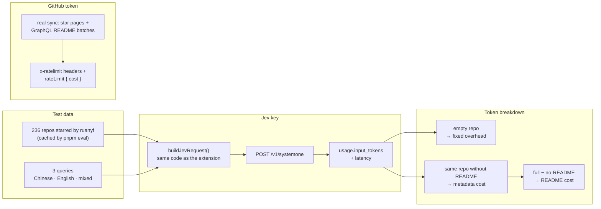
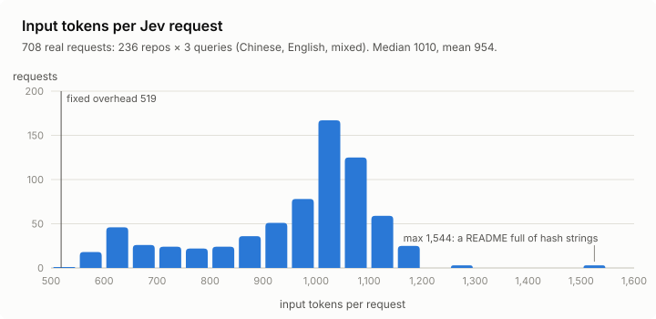
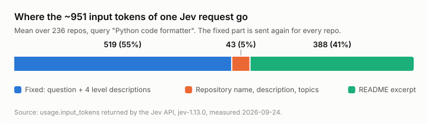
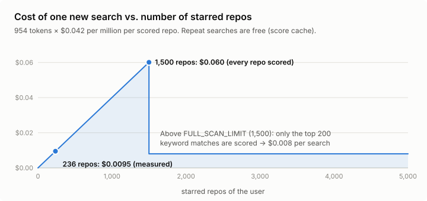

# API usage and cost

GStars uses two keys. The **Jev key** is billed per request by TypeSafe; the **GitHub token** is free but rate-limited. This page records measured usage for both, so you can predict what a search or a sync will cost.

> Measured on 2026-09-24 with `jev-1.13.0`, `QUESTION_VERSION = 2`, `README_TOKEN_BUDGET = 400`.
> Prices and rate limits come from [docs.typesafe.ai/models](https://docs.typesafe.ai/models) on the same date and may change.
> Re-measure with `pnpm eval:usage` after changing the question, the state shape or the README budget.

## How it was measured

Every number on this page comes from real API responses, not estimates. Jev returns `usage.input_tokens` with each answer, and GitHub reports each GraphQL query's cost in its `rateLimit { cost }` field.

| Run | What it measures | Requests |
| --- | --- | --- |
| 1. Full requests | 236 repos × 3 queries, exactly as the extension builds them (`pnpm eval:usage`) | 708 Jev |
| 2. Fixed overhead | The same request with an empty repository; plus a long query, and the "Test connection" sample | 3 Jev |
| 3. README share | Every repo again with the README removed; `full − no-README` is the README's real cost | 237 Jev |
| 4. GitHub sync | A real first sync of `ruanyf` (236 stars) and `gaearon` (1,493 stars), reading GitHub's per-response rate-limit headers; the GraphQL batch cost is read from `rateLimit { cost }` | ~220 GitHub |

The whole measurement cost about **$0.04** in Jev usage.

## TL;DR

| What | Cost |
| --- | --- |
| One Jev request (one repo scored for one query) | ~954 input tokens ≈ **$0.00004** |
| One new search, 236 starred repos | ≈ **$0.0095** (~1 cent) |
| One new search, 1,500 starred repos (full scan) | ≈ **$0.060** (~6 cents) |
| One new search, more than 1,500 repos (top 200 keyword matches) | ≈ **$0.008** (under 1 cent) |
| Repeating a search you already ran | **$0** (served from the score cache) |
| "Test connection" on the options page | 1 request ≈ $0.00002 |
| Syncing stars, any size | **$0** in Jev; uses under 5% of the hourly GitHub quota |

## Jev key

### Pricing

- `jev-1.13.0` charges **$0.042 per million input tokens**. Output tokens are free.
- Every answer returns `usage.input_tokens` and `usage.output_tokens`, which is what the numbers below are based on.
- Rate limits: 1,200 requests per minute and 250,000 tokens per second per account. TypeSafe notes these are being adjusted dynamically.

### Per request

708 real requests: every one of the 236 repos starred by `ruanyf`, scored for three queries (Chinese, English and mixed), with the same request builder the extension uses.

| | min | median | mean | p95 | max |
| --- | --- | --- | --- | --- | --- |
| Input tokens | 549 | 1,010 | 954 | 1,143 | 1,544 |
| Output tokens (free) | 19 | 19 | 19 | 19 | 19 |
| Latency (ms) | 246 | 291 | 325 | 497 | 1,052 |

<picture>
  <source media="(prefers-color-scheme: dark)" srcset="images/tokens-histogram-dark.svg">
  
</picture>

Where the input tokens go:

<picture>
  <source media="(prefers-color-scheme: dark)" srcset="images/tokens-breakdown-dark.svg">
  
</picture>

| Part | Mean tokens | Notes |
| --- | --- | --- |
| Fixed overhead: question, the four level descriptions, JSON keys | **519** | Measured with an empty repository. Sent again for every repo, so it is 55% of an average request. |
| The user's query | +0 to ~40 | A short query adds almost nothing; a 40-character Chinese sentence added 38 tokens. |
| Repository name, description and topics | 43 | |
| README excerpt | 388 | About 477 for the 149 repos whose README hits the truncation budget. |

The query language barely matters: the mean was 958 tokens for the Chinese query, 951 for the English one and 954 for the mixed one.

### Per search

A search scores each candidate repository once, so its cost is roughly `candidates × 954 tokens`:

<picture>
  <source media="(prefers-color-scheme: dark)" srcset="images/search-cost-dark.svg">
  
</picture>

| Starred repos | Candidates sent to Jev | Input tokens | Cost | Time |
| --- | --- | --- | --- | --- |
| 236 | 236 (all) | ~225,000 | $0.0095 | ~5 s measured |
| 1,500 | 1,500 (all, the `FULL_SCAN_LIMIT` default) | ~1,430,000 | $0.060 | at least ~75 s at 1,200 requests/min (estimated) |
| more than 1,500 | 200 (top keyword matches) | ~191,000 | $0.008 | ~4 s (estimated) |

Searches that cost nothing:

- **Repeated queries.** Scores are cached per normalized query (case and extra whitespace are ignored), README version and question version.
- **Queries shorter than 2 characters** and searches **without a Jev key**. These use keyword matching only.
- **Syncing.** Syncing only talks to GitHub.

### Example monthly budgets

Assuming 10 *new* queries a day (repeats are free):

| Starred repos | Per day | Per month (30 days) |
| --- | --- | --- |
| 236 | $0.095 | ~$2.90 |
| 1,500 | $0.60 | ~$18 |
| 5,000 (only 200 candidates scored) | $0.08 | ~$2.40 |

### Development costs

- `pnpm eval` (30 queries × 236 repos = 7,080 requests) costs about **$0.28** per question version when nothing is cached. Re-runs only pay for uncached pairs.
- `pnpm eval:usage` (708 requests) costs about **$0.03**.

## GitHub token

The GitHub token is free but limited to **5,000 REST requests per hour** and **5,000 GraphQL points per hour**. Each GraphQL README batch (10 repos) costs **1 point**, as reported by GitHub's own `rateLimit { cost }` field.

First sync, measured with the extension's sync logic:

| User | Stars | REST requests | GraphQL queries (points) | Time |
| --- | --- | --- | --- | --- |
| `ruanyf` | 236 | 4 (3 star-list pages + 1 README fallback) | 24 | 10.5 s |
| `gaearon` | 1,493 | 38 (15 star-list pages + 23 README fallbacks) | 150 | 34 s |

In general, for `N` stars:

- **REST requests:** `ceil(N / 100)` star-list pages, plus one REST call for each repo whose README is not at a common root filename. That was 0.4% to 2.3% of repos in our measurements.
- **GraphQL points:** `ceil(N / 10)`.
- **Quota share:** a 1,500-star first sync uses under 1% of the hourly REST quota and about 3% of the GraphQL quota.

Other GitHub usage:

- **Incremental check** (every 5 minutes while a Stars page is open): `ceil(N / 100)` star-list pages, plus READMEs only for new or recently pushed repos. For 1,500 stars that is about 180 REST requests an hour, or 3.6% of the quota.
- **Search:** no GitHub requests.
- **"Test connection":** calls `/rate_limit`, which does not count against the quota.

## Ways to spend less

1. **Lower `FULL_SCAN_LIMIT`** on the options page. Users above the limit only have their top 200 keyword matches scored, which caps a search at about $0.008. The trade-off: a repo that keyword recall misses is never scored.
2. **Shorten the question.** The fixed 519-token overhead is 55% of every request, so a shorter question and level descriptions could cut cost by up to half. This changes the scoring, so it needs a `QUESTION_VERSION` bump and a `pnpm eval` comparison.
3. **Lower `README_TOKEN_BUDGET`.** The excerpt is the other large part of each request. Check accuracy with `pnpm eval` before shipping.

## Known issue: the README budget is underestimated

`truncateToTokens` assumes 0.2 tokens per non-CJK character and 1 token per CJK character. Measured rates are about **0.24** and **1.18**, so excerpts cut at the 400-token "budget" really cost about **477 tokens** on average (19% more).

Text that tokenizes poorly costs much more. The worst case was `Miserlou/omnihash`, whose README is full of hash strings: 1,544 tokens for a 2,000-character excerpt. Raising the per-character estimates would bring real usage back to the budget.
